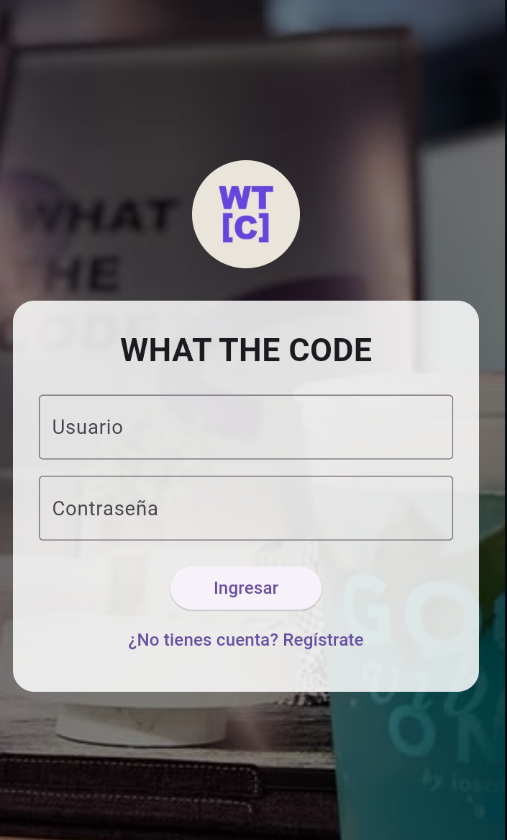
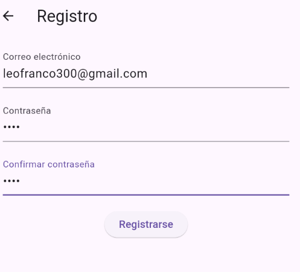
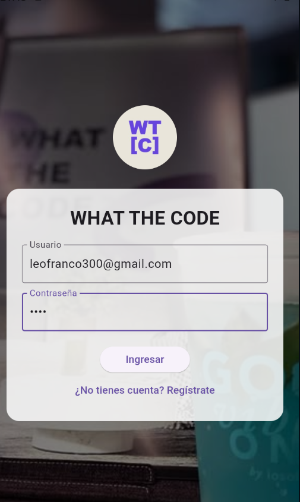
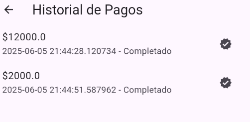
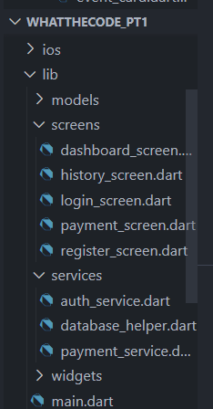

💳 Sistema de Pagos – Reto Técnico
Este proyecto es la solución al ejercicio técnico solicitado como parte del proceso de selección.
Consiste en el diseño e implementación de una API REST para un sistema de pagos, junto con una interfaz moderna desarrollada en Flutter.

📄 Descripción del Reto Técnico
🎯 Objetivo
Diseñar una API REST que permita:

Registrar nuevos usuarios

Iniciar una transacción de pago

Consultar el historial de transacciones de un usuario

Validar que una transacción esté autorizada antes de procesarla

🧪 Requisitos Técnicos
✅ Incluir un README con instrucciones de instalación y uso

✅ Implementar pruebas unitarias básicas

✅ Utilizar cualquier framework o lenguaje de programación

✅ Aplicar buenas prácticas de desarrollo y mantener un code style definido

✅ Implementar un despliegue automático mediante CI/CD

⏱️ Duración estimada: 48 horas

📱 Sistema de Pagos - Flutter App
Esta aplicación simula un sistema de pagos mediante una interfaz desarrollada con Flutter.
Permite registrar usuarios, iniciar transacciones, consultar el historial y validar pagos en tiempo real.

🖼️ Capturas de Pantalla
🔐 Login | 🧾 Registro de Usuario

    

💸 Nueva Transacción | 📊 Historial

     

🛠️ Tecnologías Usadas
Categoría	Herramienta
Framework	Flutter
Lenguaje	Dart
Tipo de app	Progressive Web / App móvil
Estado de datos	Local (puede integrarse con backend)

🔧 Instrucciones de Instalación
Clona el repositorio:

bash
Copiar
Editar
git clone https://github.com/tu-usuario/whathecode_pt1.git
cd whathecode_pt1
Instala las dependencias:

bash
Copiar
Editar
flutter pub get
Ejecuta el proyecto:

bash
Copiar
Editar
flutter run -d chrome  # o en dispositivo móvil
✅ Funcionalidades Implementadas
✔️ Registro de nuevos usuarios

✔️ Login de usuarios existentes (almacenamiento local)

✔️ Inicio de transacciones de pago

✔️ Consulta de historial de transacciones

✔️ UI adaptativa para dispositivos móviles y web

📦 Estructura del Proyecto
Visualización general de la arquitectura de carpetas:

  

🧪 Pruebas
Para ejecutar pruebas unitarias básicas:

bash
Copiar
Editar
flutter test
🚀 CI/CD
El proyecto está preparado para integrarse con sistemas de CI/CD como:

GitHub Actions

Firebase Hosting + Cloud Build (opcional)

Vercel (para web)

📬 Contacto
Desarrollador: Leonardo Franco Pérez
📧 Correo: leofranco300@gmail.com
🔗 LinkedIn: linkedin.com/in/leonardo-franco-perez

